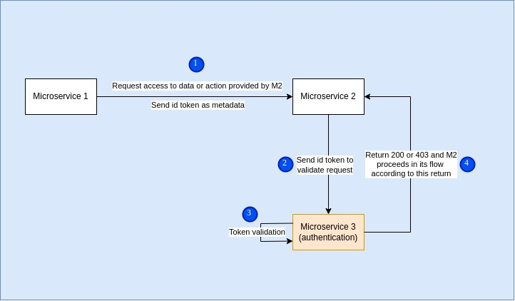

# Authentication

## Requirements
`pip install -r req.txt`

## Run server
`uvicorn main:app --reload`

## Docs
`/docs` or `/redoc`

## Authentication process

## FYI
[Argon2](https://argon2-cffi.readthedocs.io/en/stable/argon2.html#)
